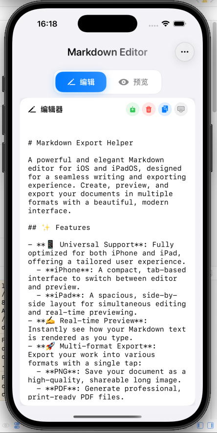
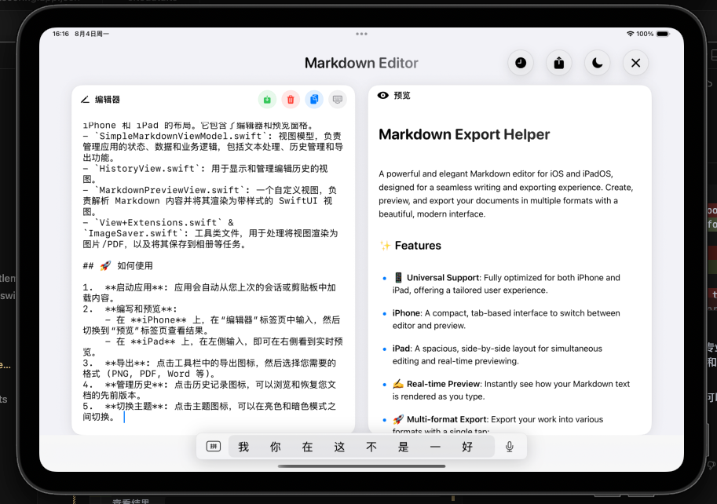

# Markdown Export Helper

A powerful and elegant Markdown editor for iOS and iPadOS, designed for a seamless writing and exporting experience. Create, preview, and export your documents in multiple formats with a beautiful, modern interface.

## ✨ Features

- **📱 Universal Support**: Fully optimized for both iPhone and iPad, offering a tailored user experience.
  - **iPhone**: A compact, tab-based interface to switch between editor and preview.
  - **iPad**: A spacious, side-by-side layout for simultaneous editing and real-time previewing.
- **✍️ Real-time Preview**: Instantly see how your Markdown text is rendered as you type.
- **🚀 Multi-format Export**: Export your work into various formats with a single tap:
  - **PNG**: Save your document as a high-quality, shareable long image.
  - **PDF**: Generate professional, print-ready PDF files.
  - **Word (`.doc`)**: Export to a format compatible with Microsoft Word.
  - **HTML**: Get a clean, standard HTML file for web use.
  - **Markdown (`.md`)**: Save the original Markdown source file.
- **🎨 Themes**: Switch between a stunning **Light Mode** and a focused **Dark Mode**.
- **📜 History Management**: Automatically saves your editing history. Easily browse, restore, or delete previous versions.
- **🧠 Smart Loading**:
  - Automatically restores your last session's content.
  - Automatically loads content from your clipboard on first launch.
- **🔧 Modern UI/UX**: A clean, intuitive interface built with SwiftUI, featuring smooth animations and a premium feel.

## 📱 Screenshots

### iPhone Layout (Tab-based)

| Editor | Preview |
| :---: | :---: |
|  |  |

### iPad Layout (Side-by-side)

| Editor & Preview |
| :---: |
|  |

## 🛠️ Project Structure

The project is built entirely with **SwiftUI** and follows a straightforward MVVM (Model-View-ViewModel) architecture.

- `ContentView.swift`: The main view of the app, which adapts its layout for iPhone and iPad. It contains the editor and preview panes.
- `SimpleMarkdownViewModel.swift`: The view model that manages the app's state, data, and business logic, including text processing, history management, and export functions.
- `HistoryView.swift`: The view for displaying and managing the editing history.
- `MarkdownPreviewView.swift`: A custom view that parses and renders Markdown content into a styled SwiftUI view.
- `View+Extensions.swift` & `ImageSaver.swift`: Utility files for tasks like rendering views as images/PDFs and saving them to the photo library.

## 🚀 How to Use

1.  **Launch the App**: Content will be automatically loaded from your last session or the clipboard.
2.  **Write & Preview**:
    - On **iPhone**, type in the "Editor" tab and switch to the "Preview" tab to see the result.
    - On **iPad**, type on the left and see the live preview on the right.
3.  **Export**: Tap the export icon in the toolbar, and choose your desired format (PNG, PDF, Word, etc.).
4.  **Manage History**: Tap the history icon to browse and restore previous versions of your document.
5.  **Switch Theme**: Tap the theme icon to toggle between light and dark modes.

---

# Markdown 导出助手

一个功能强大且设计优雅的 Markdown 编辑器，专为 iOS 和 iPadOS 打造，旨在提供无缝的写作与导出体验。通过一个精美、现代的界面，轻松创建、预览并以多种格式导出您的文档。

## ✨ 功能特性

- **📱 通用支持**: 为 iPhone 和 iPad 全面优化，提供量身定制的用户体验。
  - **iPhone**: 紧凑的标签页界面，可在编辑器和预览之间轻松切换。
  - **iPad**: 宽敞的分屏布局，支持同步编辑和实时预览。
- **✍️ 实时预览**: 在您输入时，即时查看 Markdown 文本的渲染效果。
- **🚀 多格式导出**: 只需轻轻一点，即可将您的作品导出为多种格式：
  - **PNG**: 将文档保存为高质量、易于分享的长图。
  - **PDF**: 生成专业、可供打印的 PDF 文件。
  - **Word (`.doc`)**: 导出为与 Microsoft Word 兼容的格式。
  - **HTML**: 获取简洁、标准的 HTML 文件，适用于网页。
  - **Markdown (`.md`)**: 保存原始的 Markdown 源文件。
- **🎨 主题模式**: 支持在精美的 **亮色模式** 和专注的 **暗色模式** 之间切换。
- **📜 历史管理**: 自动保存您的编辑历史。轻松浏览、恢复或删除旧版本。
- **🧠 智能加载**:
  - 自动恢复您上次会话的内容。
  - 首次启动时可自动从剪贴板加载内容。
- **🔧 现代 UI/UX**: 基于 SwiftUI 构建的纯净、直观的界面，拥有流畅的动画和高级的质感。

## 📱 应用截图

### iPhone 布局 (标签页)

| 编辑器 | 预览 |
| :---: | :---: |
|  |  |

### iPad 布局 (分屏)

| 编辑与预览 |
| :---: |
|  |

## 🛠️ 项目结构

该项目完全使用 **SwiftUI** 构建，并遵循简洁的 MVVM (Model-View-ViewModel) 架构。

- `ContentView.swift`: 应用的主视图，能自适应 iPhone 和 iPad 的布局。它包含了编辑器和预览窗格。
- `SimpleMarkdownViewModel.swift`: 视图模型，负责管理应用的状态、数据和业务逻辑，包括文本处理、历史管理和导出功能。
- `HistoryView.swift`: 用于显示和管理编辑历史的视图。
- `MarkdownPreviewView.swift`: 一个自定义视图，负责解析 Markdown 内容并将其渲染为带样式的 SwiftUI 视图。
- `View+Extensions.swift` & `ImageSaver.swift`: 工具类文件，用于处理将视图渲染为图片/PDF，以及将其保存到相册等任务。

## 🚀 如何使用

1.  **启动应用**: 应用会自动从您上次的会话或剪贴板中加载内容。
2.  **编写和预览**:
    - 在 **iPhone** 上，在“编辑器”标签页中输入，然后切换到“预览”标签页查看结果。
    - 在 **iPad** 上，在左侧输入，即可在右侧看到实时预览。
3.  **导出**: 点击工具栏中的导出图标，然后选择您需要的格式 (PNG, PDF, Word 等)。
4.  **管理历史**: 点击历史记录图标，可以浏览和恢复您文档的先前版本。
5.  **切换主题**: 点击主题图标，可以在亮色和暗色模式之间切换。 